# TP 4 Administration SSH et Serveur Web Nginx

## Partie 1/2 

Serveur ssh installé et actif
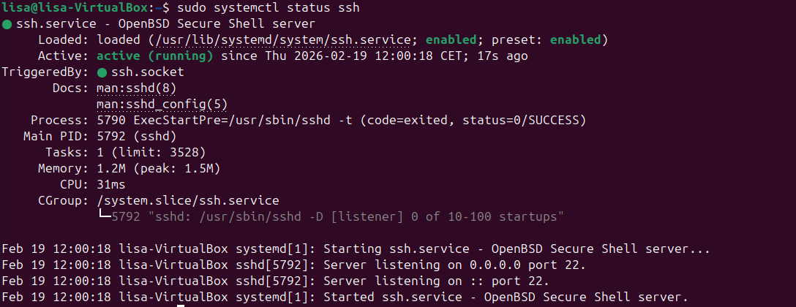

SSH écoute bien sur le port 22
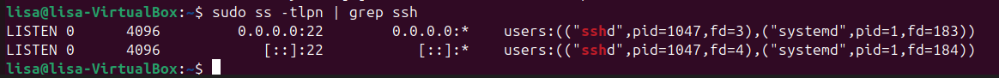

Connection SSH depuis mon pc
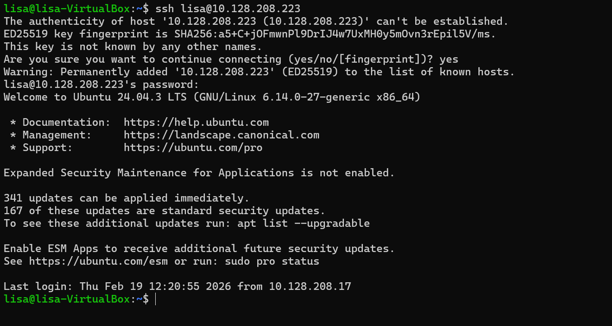

Je génère une clé SSH sur mon pc
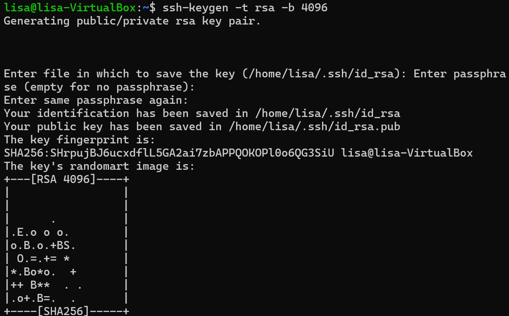

Je copie la clé sur le serveur
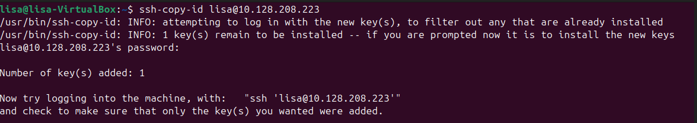

Connection SSH sans mot de passe
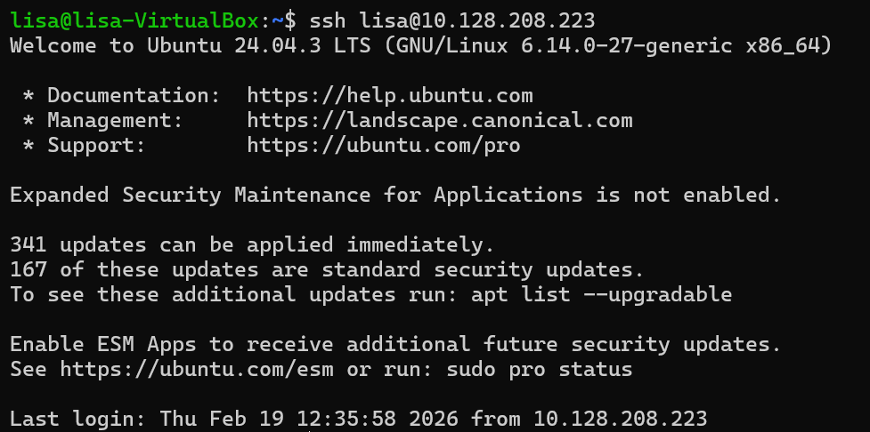

## Partie 3 

Le fichier à modifier est ```/etc/ssh/sshd_config ```

Pour interdire l'accès root, je remplace la ligne ```#PermetRootLogin prohibit-password``` par ```PermitRootLogin no```
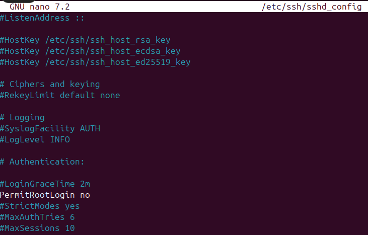

Désativer l'authentification par mot de passe.
Dans le même fichier on remplace ```#PasswordAuthentication yes```par ```PasswordAuthentication no```
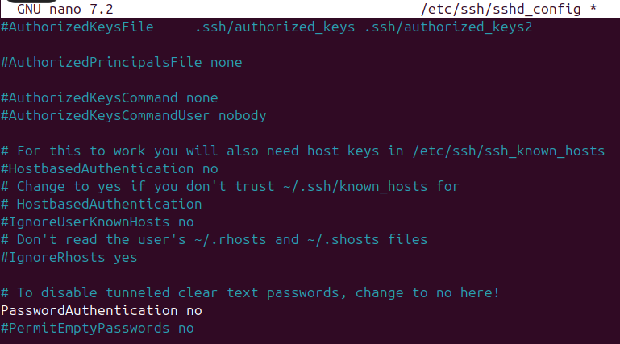

Changer le port par défaut
Toujours dans le même fichier, on remplace ```#Port 22``` par ```Port 2222```

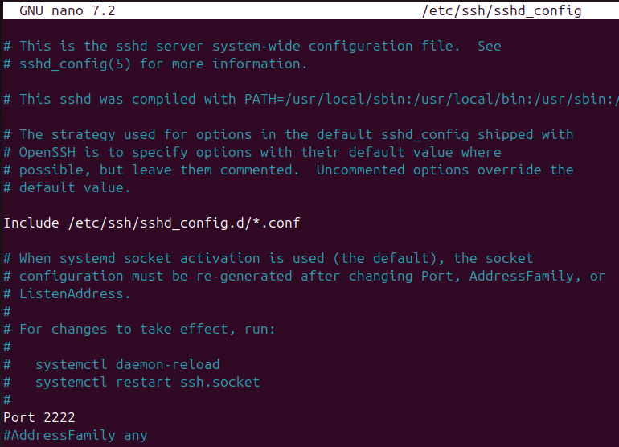

Il faut ensuite redémarrer le service SSH pour que les modifications soient prises en compte et tester le nouveau port depuis la machine cliente.
```sudo systemctl restart ssh```


## Partie 4
J'ai d'abord créer un dossier de test à envoyer.

#### SCP
Puis j'ai fait la commande pour envoyer un fichier vers le serveur
```
scp fichier.txt etudiant@<IP_VM>:/home/etudiant/
```
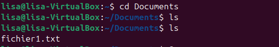
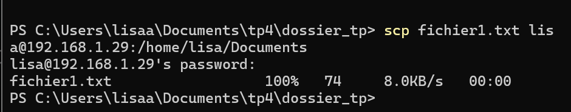

Pour envoyer un dossier, c'est la même commande mais on rajoute ```-r```:
```
scp -r dossier_tp lisa@192.168.1.29:/home/lisa/Documents
```
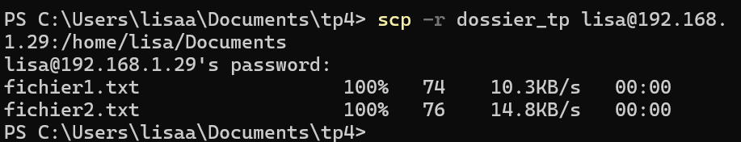

#### SFTP
Pour ouvrir une session SFTP
``` 
sftp lisa@192.168.1.29
```
On peux voir les fichiers que j'ai transféré juste avant.
Pour envoyer un dossier/fichier, c'est la commande ```put nom_du_fichier``` et ```put -r nom_du_dossier```

#### RSYNC
J'ai ouvert mon dossier test avec git bash.
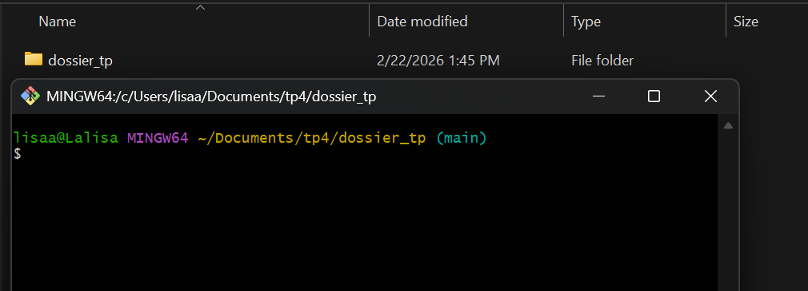
Puis dans le terminal, la commande pour synchroniser le dossier:
```
rsync -avz mon_dossier/ lisa@192.168.1.29:/home/lisa/mon_dossier_sync/
```

## Partie 5
Dans ma vm, pour suivre les logs d'authentification:
``` 
sudo tail -f /var/log/auth.log
```
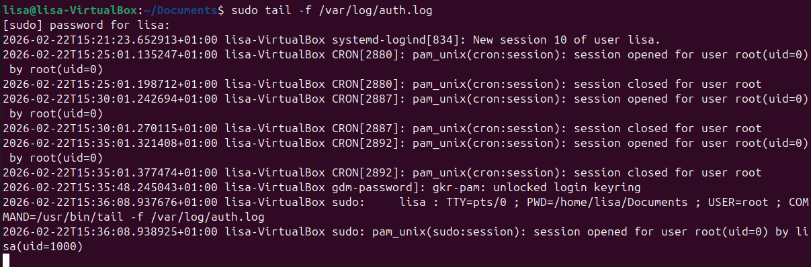

Ensuite on installe Fail2Ban
```
sudo apt update
sudo apt install fail2ban
```
Je crée un fichier que je vais nommer "jail.local" pour configurer fail2ban.

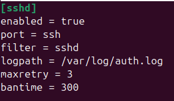

enabled = true → active la protection SSH
port = ssh → surveille le port 22
filter = sshd → utilise le filtre prévu pour SSH
ogpath = /var/log/auth.log → lit les logs d’authentification
maxretry = 3 → 3 erreurs → ban
bantime = 300 → ban 5 minutes

On redémarre le service :
```
sudo systemctl restart fail2ban
```
Je tente de me cnnecter a ssh à partir de mon windows, mais je me trompe de mot de passe 3 fois, pour voir si je me fait bannir.
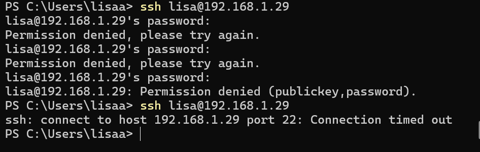

## Partie 6
1. Tunnel local → accéder à un service web distant depuis Windows. Exemple avec le site web Apache. 
J'installe Apache sur ma vm et je vérifie qu'il tourne avec le port 80.
Dans windows je fais:
```
ssh -L 9090:localhost:80 lisa@192.168.1.29
```
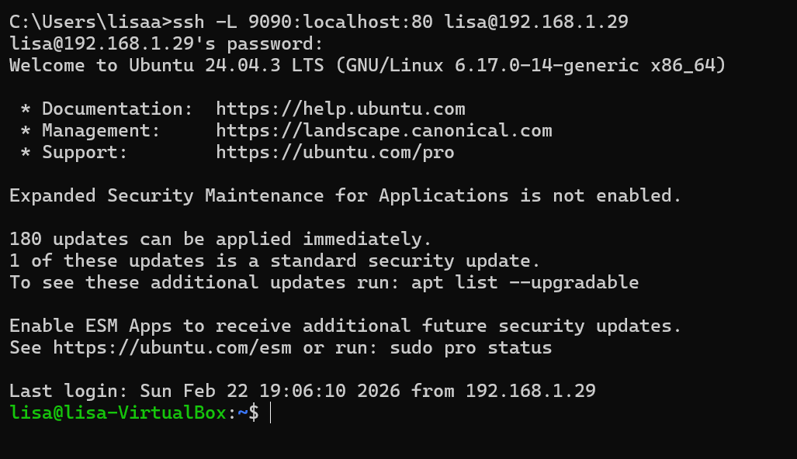

Et je laisse la fenêtre ouverte.
Puis dans mon navigateur je teste:
```
http://localhost:9090
```
La page Apache de ma vm s'affiche.
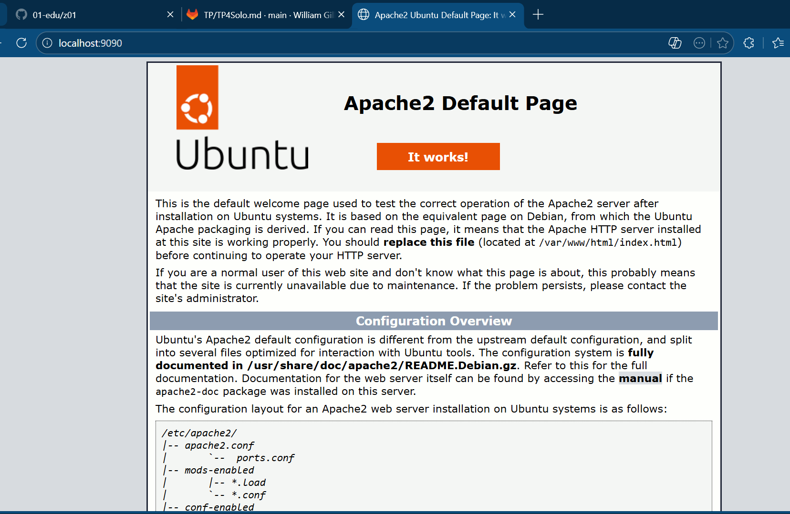

2. Tunnel distant → permettre l’accès SSH au client via le serveur
Depuis windows je met:
```
ssh -R 2222:localhost:22 lisa@192.168.1.29
```
Ensuite sur ma vm je met:
```
ss -tulnp | grep 2222
```
Le tunnel distant fonctionne, mais la VM ne peut pas vraiment se connecter à Windows car Windows n’a pas de serveur SSH actif par défaut.

## Partie 7
Installer Nginx ```sudo apt install nginx```

Je crée le dossier du site (et je donne les droits que je veux)
```
sudo mkdir -p /var/www/site-tp
sudo chown -R $USER:$USER /var/www/site-tp
```
Je crée un fichier pour créer la page d'accueil du site en html
```
sudo mkdir -p /var/www/site-tp
sudo chown -R $USER:$USER /var/www/site-tp
```
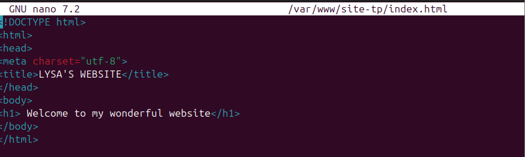

Je crée un fichier de configuration Nginx pour le site
```
sudo nano /etc/nginx/sites-available/site-tp
```
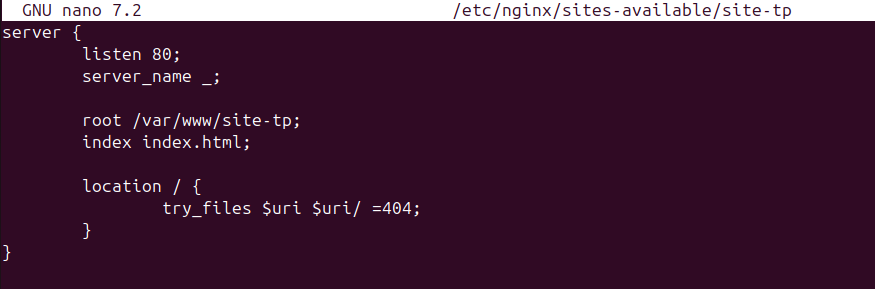

J'active le site et je recharge nginx pour appliquer les commandes.
```sudo ln -s /etc/nginx/sites-available/site-tp /etc/nginx/sites-enabled/
sudo systemctl reload nginx
```
Toute les commandes: 


Pour le certificat auto-signé.
Je crée un dossier pour le stocker ```sudo mkdir /etc/nginx/certs```
Je génère une clé privée et un certificat auto-signé
```
sudo openssl req -x509 -nodes -days 365 -newkey rsa:2048 \
  -keyout /etc/nginx/certs/site.key \
  -out /etc/nginx/certs/site.crt
```
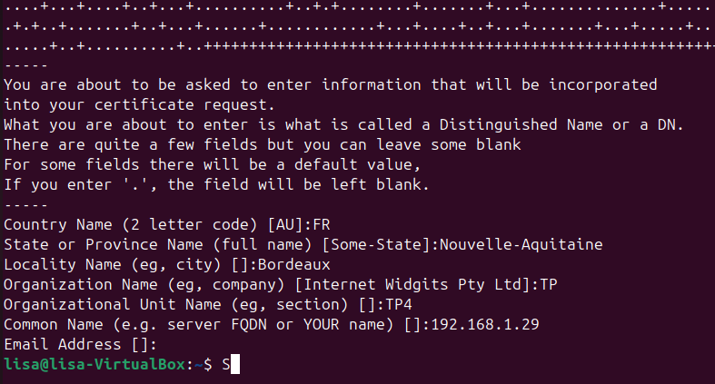

Pour la configuration HTTPS et la redirection
Je modifie le fichier "site-tp" pour activer https et rediriger automatiquement le HTTP vers HTTPS
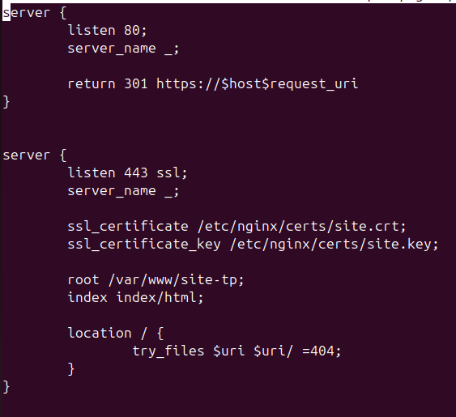

Je teste la configuration ```sudo nginx -t```. Il faut qu'il y ait marqué "syntax is ok, test is successful". Puis je recharge Nginx.

Enfin je teste dans mon powershell de voir le fichier.
```
curl -k https://192.168.1.29
```
J'ai restreint les droits sur le dossier ce qui empêche donc d'accéder a tout le contenu du ficihier. Voici donc çe que ça donne.

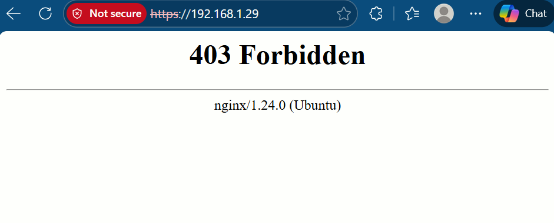
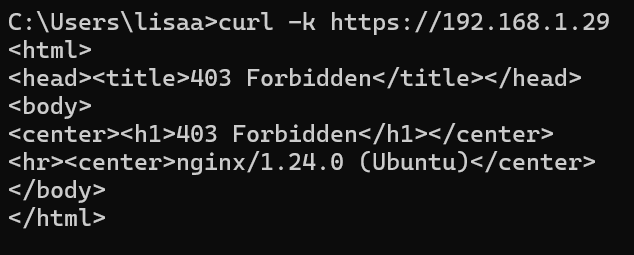

Pour pouvoir voir le contenu, il me suffit de changer les droits en lecture autorisé par tout le monde.

## Partie 8
La commande pour autoriser Nginx dans le firewall: 
```
sudo ufw allow 'Nginx Full'
```
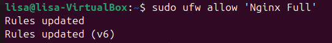

Pour éviter que Ngix envoie une erreur, je vérifie les permissions du site /var/www/site-tp.

Ensuite je donne la propriété du dossier à Nginx et je donne les permissions de lecture:
```
sudo chown -R www-data:www-data /var/www/site-tp
sudo chmod -R 755 /var/www/site-tp
```
