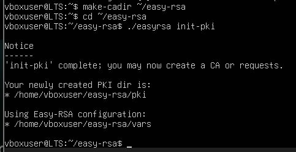
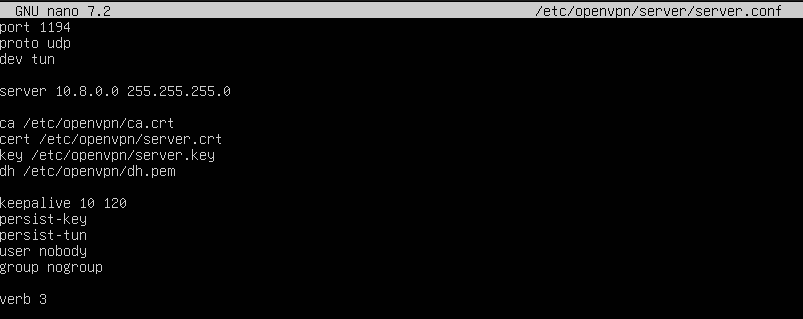
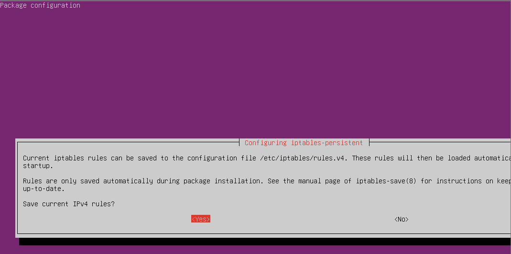
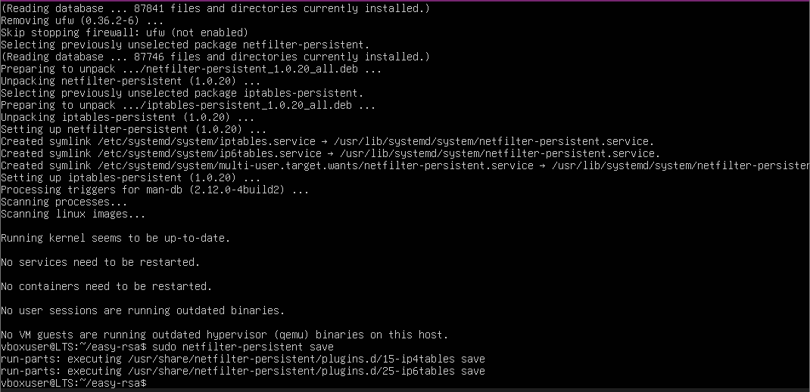
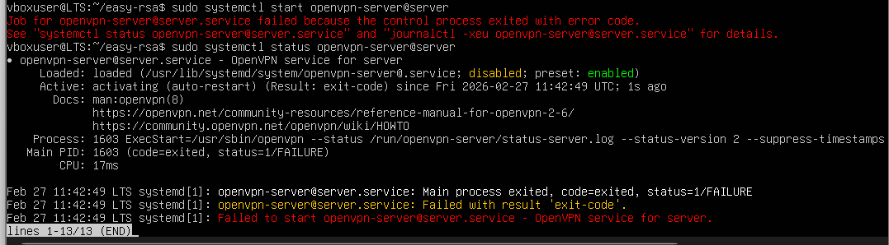
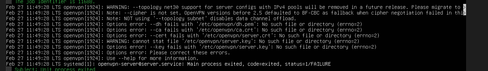

# TP 6 Mise en place d'un serveur OpenVPN sur Ubuntu Server

### Mise en place
Mettre à jour et installer les paquets nécessaires:
```
sudo apt update
```
```
sudo apt install openvpn easy-rsa -y
```

## Partie 1: Comprendre la PKI
Questions: 
1. Une AC est une organisation qui valide les identités et émet des certificats numériques. Dès que l'entité est vérifié, le rôle de l'AC est de leur lier des clés cryptographiques.
2. La clé privé sert à décrypter les données chiffrées avec la clé publique et ne doit jamais être partagé. Le certificat est publique et sert à prouver l'authenticité de la clé publique.
3. Le serveur VPN a besoin de prouver son identité afin d'établir la confiance et de chiffre correctement les communications.

### Création de l'infrastructure Easy-RSA
Commencer par créer le dossier et initialiser la PKI


Puis on génère l'autorité de certification, le certificat du serveur, le certificat client.


Les paramètres Diffie-Hellman 


Une clé TLS supplémentaire


Question:
1. Easy-RSA crée tous les fichiers dans le dossier que j'ai initialisé.
2. Il contient tous les éléments cryptographiques généré automatiquement par Easy-RSA.
3. Le gen-req génère une requête de certificat, c'est une demande. Avec sign-req, la CA signe la CSR pour avoir un certificat valide.
4. Si on oublie de signer, le certificat n'est pas valide et pas utilisabke.

## Partie 2: Configuration du serveur OpenVPN
Je crée le fichier et configure le serveur. 


Questions:
1. dev turn crée une interface virtuelle nommé TUN et qui est utilisé pour transporter des paquets IP.
2. UDP est rapide et c'est recommendé pour un VPN. TCP est plus lent mais quand même fiable.
3. Le mieux est une plage privée qui n'est pas utilisé ailleurs. Poure éviter les conflits, faciliter le routage et isoler le réseau VPN.

Pour activer l'IP forwarding:




Questions:
1. ip_forward se configure dans /etc/sysctl.conf.
2. sudo iptables -t nat -L -n -v affiche les règles NAT actuelles.
3. Le réseau n'est pas routable sur Internet, donc il ne faut pas masquerader le réseau VPN.

Démarrer le service OpenVPN et verifier son etat.

Le service échoue au démarrage, il y a un problème de configuration.

Questions:
1. sudo journalctl -u openvpn-server@server
2. status donne les dernières lignes du journal et journalctl donne tous les logs complets.
3. Pour résoudre le problème, on va regarder les logs. Voici l'erreur.



Il faut vérifier dans server.conf qu'on a configurer tout à l'heure,
