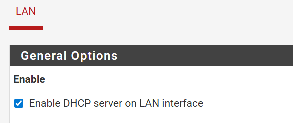
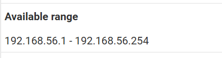
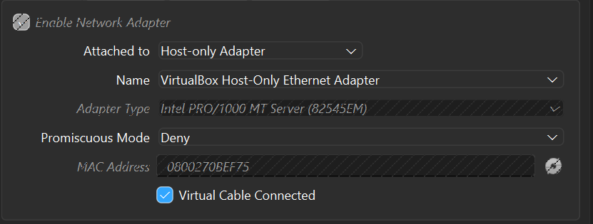
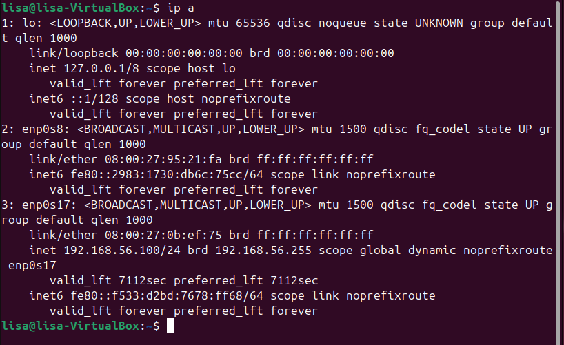
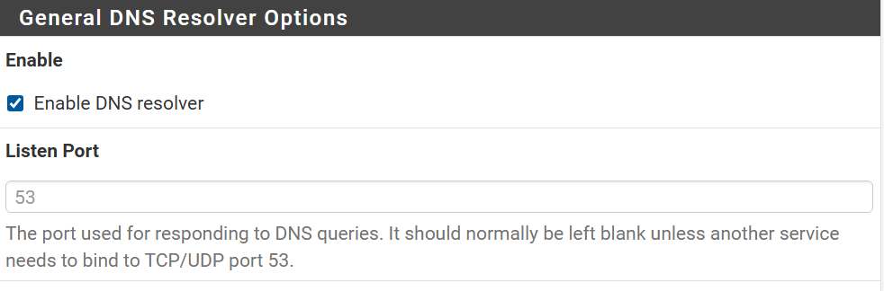

# TP 5 Bases d'un pare-feu

## Partie 1
### 1. Accès à l'interface
Questions:
1. L'adresse IP du LAN est ```192.168.56.3```
2. L'adresse IP du WAN est ```10.0.2.15```
3. On utilise https pour accéder au site web de pfSense pour permettre d'avoir accès aux paramètres et de sécuriser la connexion. pfSense contrôle tout le réseau.
4. Pour mieux sécuriser la connexion. 

### 2. Sécuriation de l'accès administrateur
Questions:
1. Les paramètres du compte administrateur se modifient dans l’interface web de pfSense, via le menu System → User Manager.


2. Un mot de passe robuste est long, avec des majuscules et des caractères spéciaux.

3. L'administrateur doit être sécurisé en priorité car il a un contrôl sur tout. Il est donc important de bien le sécuriser, notamment avec un mot de passe robuste.

## Partie 2
### 3.Vérification des interfaces
Pour vérifier l'affection WAN/LAN on va dans Status → Interfaces

Questions:
1. L'interface WEN permet l'accès à internet.
2. L'interface LAN correspond au réseau interne.
3. Avec les interfaces inversées, le réseau internet serait exposé à internet, l'accès administrateur ne serait plus possible, et le firewall ne pourra plus proteger quoi que ce soit.

## Partie 3
### 4. DHCP
Pour configurer le serveur DHCP pour le réseau LAN, on va dans Services --> DHCP Server. Puis on coche:


Questions:
1. DHCP attribu automatiquement une adresse IP, c'est plus simple à gérer et ça évite les conflits d'adresses IP.
2. Il faut que ce soit dans le même réseau que l'interface LAN, et on laisse les premières adresses par précaution. On peux prendre par exemple entre 192.168.56.100 - 192.268.56.200. 
pfsense nous donne aussi les adresses qu'on peut utiliser. 

3. Il faut eviter l'adresse de pfsense (ici 192.168.56.3), celles réserver pour les IP fixes, et les adresses réseau et broadcast

Vérification adresse ip Ubuntu.
Sur ma vm xubuntu, j'ai configuré le réseau comme ceci:

Puis je vérifie avec ```ip a```, et une adresse à bien été attribué automatiquement, et dans ma range choisi (192.168.56.100). 


### 5. DNS
Le résolveur DNS est activé.


Questions:
1. Le pare-feu est placé entre mon réseau interne et internet, il peux donc résoudre les noms de domaine pour les machines du LAN, filtrer les requêtes DNS et plus.
2. La connection internet marche, mais la résolution de noms est en panne. On peut ping mais pas avec le nom des sites web.

## Partie 4
### 6. Règles de pare-feu
Pour permettre aux machines du LAN d'accèder à Internet, dans Firewall puis Rules: 
