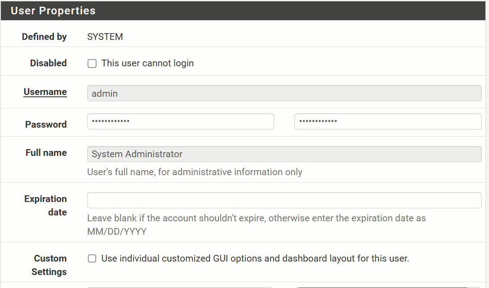

# TP 5 Bases d'un pare-feu

## Partie 1
### 1.
Questions:
1. L'adresse IP du LAN est ```192.168.56.3```
2. L'adresse IP du WAN est ```10.0.2.15```
3. On utilise https pour accéder au site web de pfSense pour permettre d'avoir accès aux paramètres et de sécuriser la connexion. pfSense contrôle tout le réseau.
4. Pour mieux sécuriser la connexion. 

### 2.
Questions:
1. Les paramètres du compte administrateur se modifient dans l’interface web de pfSense, via le menu System → User Manager.


2. Un mot de passe robuste est long, avec des majuscules et des caractères spéciaux.

3. L'administrateur doit être sécurisé en priorité car il a un contrôl sur tout. Il est donc important de bien le sécuriser, notamment avec un mot de passe robuste.

## Partie 2
### 3.
Pour vérifier l'affection WAN/LAN on va dans Status → Interfaces

Questions:
1. L'interface WEN permet l'accès à internet.
2. L'interface LAN correspond au réseau interne.
3. Avec les interfaces inversées, le réseau internet serait exposé à internet, l'accès administrateur ne serait plus possible, et le firewall ne pourra plus proteger quoi que ce soit.

## Partie 3
### 4
